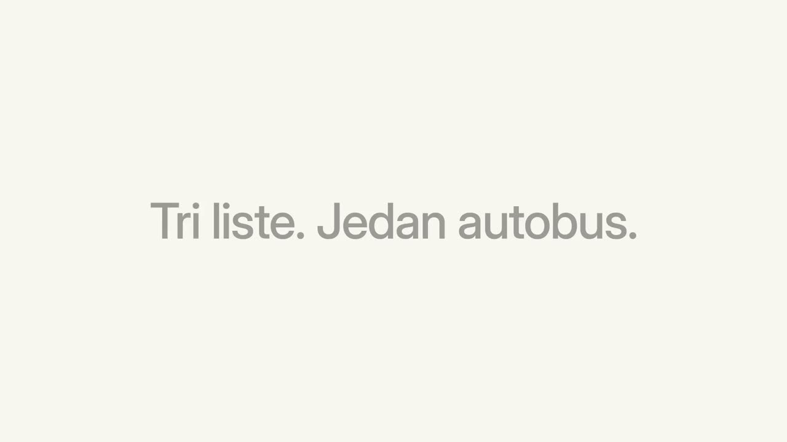

<div align="center">


# SURP

**Reservation and dispatch software for intercity bus agencies.**

[Website](https://surp.rs) · [Deployment](docs/deployment.md) · [Contributing](CONTRIBUTING.md) · [Security](SECURITY.md)

[](https://github.com/kcne/surp/actions/workflows/backend-ci.yml)
[](https://github.com/kcne/surp/actions/workflows/frontend-ci.yml)
[](LICENSE)

</div>

[](https://media.surp.rs/presentation-site.mp4)

<p align="center"><sub>Click to watch the product demo.</sub></p>

## About

SURP runs the daily work of a bus agency: timetables, bookings, passenger
lists, and the departures that actually leave. It is in production with
agencies in Serbia, so the on-screen UI is in Serbian; code and docs are in
English.

- **Reservations** — book one-way and return trips against a specific departure
- **Schedule and dispatch** — lines, stations, timetables, cancelled and extra buses
- **Passengers** — passenger records and passenger lists per departure
- **Online booking** — a public storefront each agency can turn on
- **Multi-tenant** — every agency's data is isolated; one platform admin oversees all

## Quick start

Requires Node.js 20+, pnpm 10+, and Docker.

```bash
git clone https://github.com/kcne/surp.git && cd surp
docker compose -f api/docker-compose.yml up -d postgres
```

Start the API on http://localhost:3001 (interactive docs at `/docs`):

```bash
cd api
cp .env.example .env
pnpm install
pnpm prisma:generate && pnpm prisma:migrate:deploy && pnpm prisma:seed
pnpm start:dev
```

In a second terminal, start the UI on http://localhost:3000:

```bash
cd ui
pnpm install
pnpm dev
```

Sign in with the seeded demo agency account: `admin@demo.local` /
`demo-admin-pass`.

## Repository layout

```text
api/   NestJS + Prisma + PostgreSQL backend, OpenAPI schema in api/docs/
ui/    Next.js + Tailwind frontend; API client generated from the schema
ops/   Production jobs: database backup, staging refresh, releases, rollback patches
docs/  Project documentation
```

## Documentation

- [Deployment](docs/deployment.md) — Railway setup and environment variables
- [Quality gates](api/docs/quality-gates.md) — the checks every PR must pass
- [Database backup](ops/backup/README.md) and [staging refresh](ops/staging-refresh/README.md)
- API reference — run the API and open `/docs`

## Contributing

Contributions are welcome. Read [CONTRIBUTING.md](CONTRIBUTING.md) before
opening a pull request, and report vulnerabilities privately as described in
[SECURITY.md](SECURITY.md).

## License

[MIT](LICENSE)
